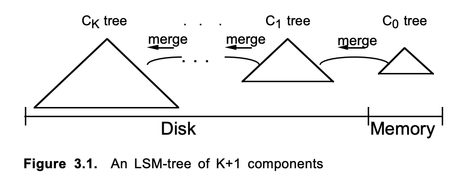
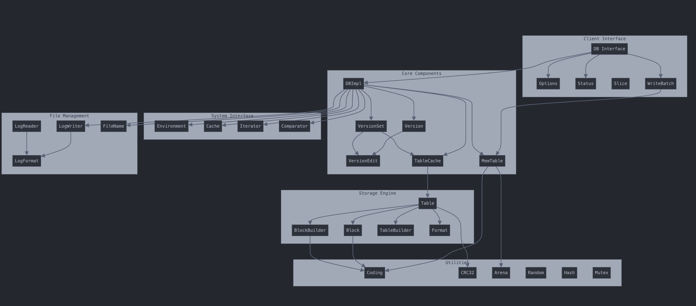
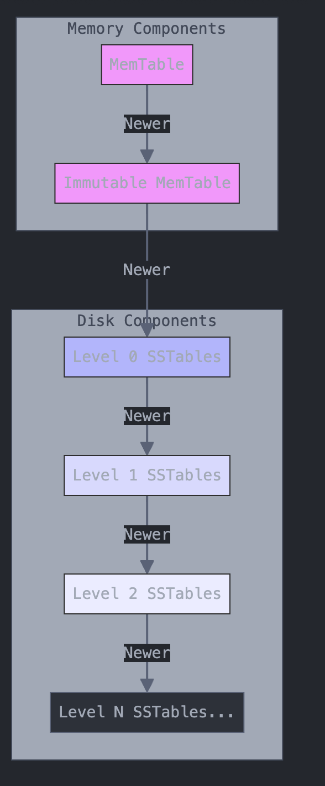
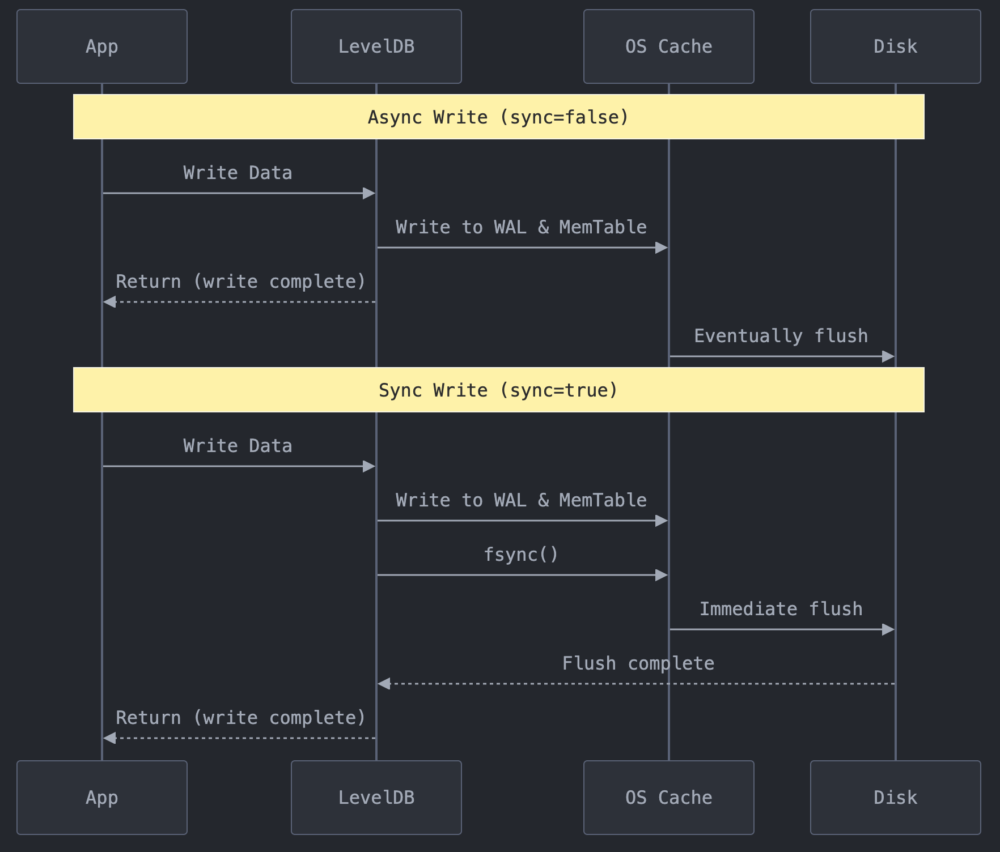
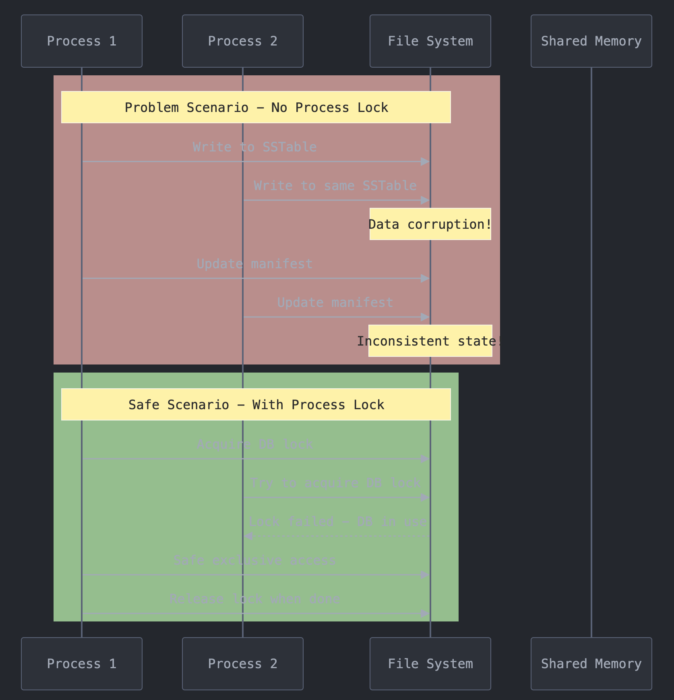
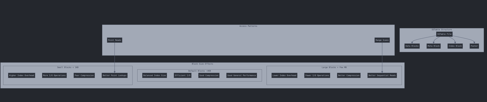

### History

https://web.archive.org/web/20110513032000/http://code.google.com:80/p/leveldb/source/browse/#svn%2Ftrunk

Commit
* be9f061d2fd5e2d66ba17a70c135a153c584c8c1

# LevelDB

## Why is this repo interesting
This seems to be first big scale implementation of write-optimized structures using LSMs and was used at scale google. WHy? I'm not sure. They had bigtable before and maybe it wasn't suited for heavy writes? Few things by google open sourced.

## Impressions
It's made by [Jeff Dean and Sanjay Ghemawat](https://www.newyorker.com/magazine/2018/12/10/the-friendship-that-made-google-huge), the only L11s at google and basically the ones who built and scaled google... to what it is today. It's made for harddisks because seeks suck on harddisks. I think I have a harddisk repo to benchmark this on so, I think it should be good. I want to compare versus a btree obviously :). Why even use b-trees anymore? Since writes are so good?

Also this was way back in 2011, which was cool.

## Background
[LSMS](https://en.wikipedia.org/wiki/Log-structured_merge-tree) are an old invention back in 1996 by Patrick O'Neil. [The paper](https://www.cs.umb.edu/~poneil/lsmtree.pdf) is cool. Very old paper and it talk s a lot about megabytes and kilobytes to get a perspective

Here's an image from the paper:


Essentially, each level of the tree is gets bigger and bigger (from memory to disk). Over time, as more data is inserted, each level has to combined with the bigger tree below it (whether it is in memory or disk)

Nothing really considered "write optimized system" along these times. Everyone was using btrees (for say, MySQL)

## Summary

Here's a visualization of components:



Let's read the `docs/` folder which includes `docs/impl.html`, `docs/index.html`, `docs/log_format.txt`, `docs/table_format.txt`

### impl.html
```c
leveldb::DB* db;
leveldb::Options options;
options.create_if_missing = true;
leveldb::Status status = leveldb::DB::Open(options, "/tmp/testdb", &db);
assert(status.ok());
```

```c
std::string value;
leveldb::Status s = db->Get(leveldb::ReadOptions(), key1, &value);
if (s.ok()) s = db->Put(leveldb::WriteOptions(), key2, value);
if (s.ok()) s = db->Delete(leveldb::WriteOptions(), key1);
```

Seems intuitive

```c
leveldb::WriteBatch batch;
batch.Delete(key1);
batch.Put(key2, value);
s = db->Write(leveldb::WriteOptions(), &batch);
```

> The WriteBatch holds a sequence of edits to be made to the database, and these edits within the batch are applied in order. Note that we called Delete before Put so that if key1 is identical to key2, we do not end up erroneously dropping the value entirely. Apart from its atomicity benefits, WriteBatch may also be used to speed up bulk updates by placing lots of individual mutations into the same batch.

Seems like a transaction sort of thing

```c
leveldb::WriteOptions write_options;
write_options.sync = true;
db->Put(write_options, ...);
```

> By default, each write to leveldb is asynchronous: it returns after pushing the write from the process into the operating system. The transfer from operating system memory to the underlying persistent storage happens asynchronously. The sync flag can be turned on for a particular write to make the write operation not return until the data being written has been pushed all the way to persistent storage. (On Posix systems, this is implemented by calling either fsync(...) or fdatasync(...) or msync(..., MS_SYNC) before the write operation returns.)

> Asynchronous writes are often more than a thousand times as fast as synchronous writes. The downside of asynchronous writes is that a crash of the machine may cause the last few updates to be lost. Note that a crash of just the writing process (i.e., not a reboot) will not cause any loss since even when sync is false, an update is pushed from the process memory into the operating system before it is considered done.

Does this mean that the crash causes the data to be lost if it's async? That makes sense... here's a visualization


So the WAL isn't flushed after it gets full or some x time. I didn't know about this. (because it's in the OS cache)

> A database may only be opened by one process at a time. The leveldb implementation acquires a lock from the operating system to prevent misuse. Within a single process, the same leveldb::DB object may be safely used by multiple concurrent threads.

Why? Because another process can corrupt the WAL/SSTable


```c
leveldb::Iterator* it = db->NewIterator(leveldb::ReadOptions());
for (it->SeekToFirst(); it->Valid(); it->Next()) {
cout << it->key().ToString() << ": "  << it->value().ToString() << endl;
}
```

It's ordered, and seeks through both memtable the SSTables.


##### Block size

> leveldb groups adjacent keys together into the same block and such a block is the unit of transfer to and from persistent storage. The default block size is approximately 4096 uncompressed bytes. Applications that mostly do bulk scans over the contents of the database may wish to increase this size. Applications that do a lot of point reads of small values may wish to switch to a smaller block size if performance measurements indicate an improvement. There isn't much benefit in using blocks smaller than one kilobyte, or larger than a few megabytes. Also note that compression will be more effective with larger block sizes.

Point lookups are better for smaller (more I/O, less to read), and ranges for bigger (less I/O)



##### Compression

> Each block is individually compressed before being written to persistent storage. Compression is on by default since the default compression method is very fast, and is automatically disabled for uncompressible data. In rare cases, applications may want to disable compression entirely, but should only do so if benchmarks show a performance improvement:

```x
  leveldb::Options options;
  options.compression = leveldb::kNoCompression;
  ... leveldb::DB::Open(options, name, ...) ....
```

I'll check it out and want to see how much compression affects performance

##### Cache

```c
  leveldb::Options options;
  options.cache = leveldb::NewLRUCache(100 * 1048576);  // 100MB cache
  leveldb::DB* db;
  leveldb::DB::Open(options, name, &db);
  ... use the db ...
  delete db
  delete options.cache;
```

> Note that the cache holds uncompressed data, and therefore it should be sized according to application level data sizes, without any reduction from compression. (Caching of compressed blocks is left to the operating system buffer cache, or any custom Env implementation provided by the client.)


I'll check it out and want to see how much cache affects performance. Why not compress? Makes reads fast I guess?


## Why did they design it this way?

## Tried/Didn't do?

## Match impressions?

## Running it

level1.1 (2011)

```
port/port_posix.h
#include <cstdatomic> -> #include <atomic>

Makefile
#OPT = -O2 -DNDEBUG
OPT = -g2
Change to release

make all -j
```

Suprising it compiles out of the box


## Strengths

## Weaknesses

## Comparison to related repos/ideas

bigtable

